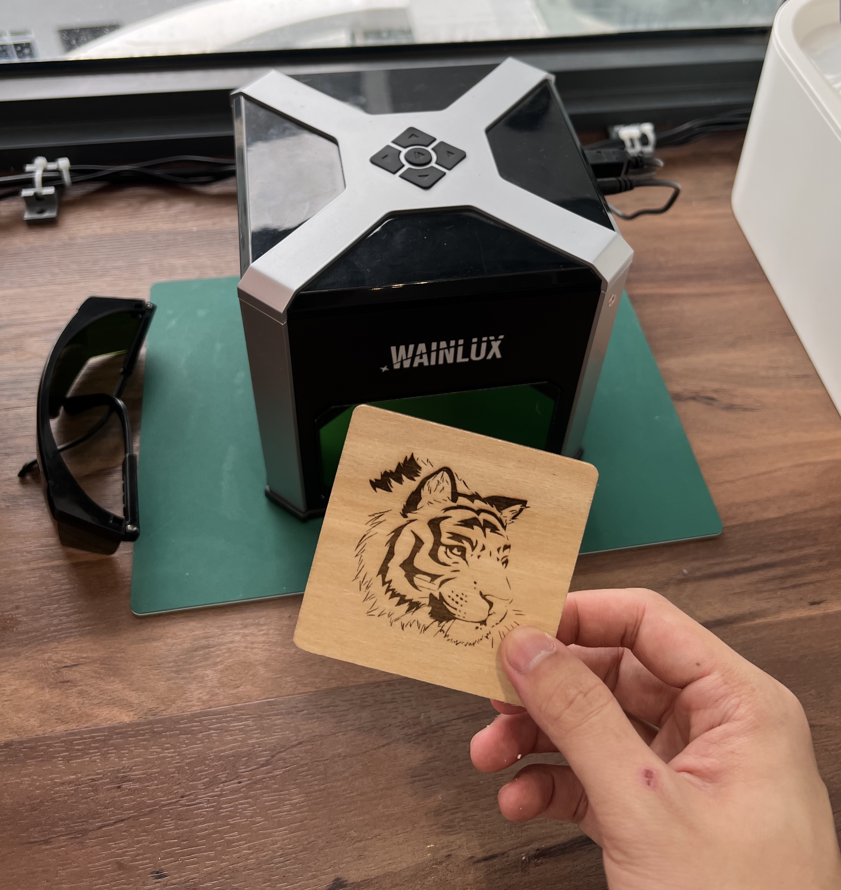

*My Wainlux K6 laser engraver is great at basic laser engraving and cutting, however it’s a purely wired device which requires me to connect a physical cable between it and my laptop whenever I need to use it. The only time it works wirelessly is when it’s connected to a phone hotspot, and even then I’d need to use the actual phone to control the machine and upload the image files. To address these inconveniences, I connect the engraver to a Raspberry Pi that I connect to remotely using SSH/VNC so I can do everything from my laptop without needing to connect any more cables!*

# Lasers?

Yes, lasers! The [Wainlux K6](https://www.wainlux.com/products/wainlux-k6-mini-laser-engraving-machine) is a small laser engraver/cutter that works on many different materials that I [backed on Kickstarter ages ago](https://www.kickstarter.com/projects/2109720319/engrave-your-creativity-anytime). To be completely honest, I haven’t used it much since I got it, mainly because I don’t have many things to engrave or cut. However, when I made a commitment earlier this year to tidy up and organize my workshop better, I decided to set it up on my workbench and try to take on projects to use it more. If anything, it’s just to get my money’s worth 😜 Here's a test engraving I did with the K6- the tiger art and wood came with the engraver:


  
# The problem

After setting up the K6 and making sure it was engraving as intended, I realized something about the device that bothered me: unlike my other workshop equipment, like my 3D printers, the engraver needed to be constantly connected to the computer in order to engrave anything. More specifically, if I wanted to use the K6, I would have to either:

1. Connect my laptop to it via a USB cable and launch their proprietary Java application to control the engraver.

2. Activate my phone’s mobile hotspot with a specific password, and use the proprietary app to control the engraver.

<div style="width:100%;height:0;padding-bottom:50%;position:relative;"><iframe src="https://giphy.com/embed/xwPaabcYMs6kP1Czu3" width="100%" height="100%" style="position:absolute" frameBorder="0" class="giphy-embed" allowFullScreen></iframe></div><p><a href="https://giphy.com/gifs/hulu-season4-the-handmaids-tale-thehandmaidstale-xwPaabcYMs6kP1Czu3">via GIPHY</a></p>

The fact that there’s no way to wirelessly connect my laptop to the engraver was a huge hit to my workflow- it meant that I would need to physically unplug my laptop from my desk and bring it to the K6 and plug it in and leave it there for the duration of the process while it does its thing. It was either that or do all the work wirelessly, *but from my phone* 🤢🤮 I decided that I would rather spend time developing a workaround than to accept this existence as fate.

# The solution

> [!info] In the interest of not turning this blog post in to a full-blown tutorial that’s dripping with too many details, this section goes over a **high-level** approach regarding how I implemented the solution. If you’ve worked with Raspberry Pis before then it should be fairly familiar. If you haven’t, you might need to do some further reading for everything here to make sense. I’ve tried to include useful links to point you in the right direction.

Naturally, I had a bunch of spare Raspberry Pis lying around. [I’ve used them in the past before to convert a “dumb” wired-only printer into a Wifi-accessible printer via CUPS](https://www.tomshardware.com/how-to/raspberry-pi-print-server), so I figured I could take a similar approach to upgrade the K6.

## Setting up the RPi

As with all of my RPi based projects, I always start with a fresh flash of Raspbian. Now, I usually use the headless (non-GUI) variants for most of my projects, but this particular use case required the GUI version (more on that later). The steps I took for setup were:

1. Used the [Raspberry Pi Imager](https://www.raspberrypi.com/software/) to flash the latest version of Raspbian onto an SD card.

2. With the SD card still mounted:

	1. Created the `ssh` file in `/boot` to enable SSH.

	1. Created the `[wpa_supplicant.conf](https://www.raspberrypi-spy.co.uk/2017/04/manually-setting-up-pi-wifi-using-wpa_supplicant-conf/)` file in `/boot` so that the Pi would connect itself to my Wifi network on first startup.

		1. I actually didn’t need to do this step because I could have easily connected to the Wifi manually with the GUI, but it was a habit from often working headless.

3. Unmounted the SD card and inserted it into the RPi and powered it up.

4. After a minute of startup time, I successfully managed to SSH into the device with this procedure:

	1. Connected to the same Wifi as the RPi.

	1. Type `ssh pi@<RPi IP address>` in a terminal.

		1. I got my RPi IP address by looking at my router’s connected devices.

	1. Enter the RPi password for the `pi` user. Default is `raspberry`

	1. If you set up a different user on the RPi, feel free to use that as the username instead of `pi`.

2. Once SSH’d in, I used the `passwd` command to change the default password.

<div style="width:100%;height:0;padding-bottom:83%;position:relative;"><iframe src="https://giphy.com/embed/dBGi39HzazuTV21S15" width="100%" height="100%" style="position:absolute" frameBorder="0" class="giphy-embed" allowFullScreen></iframe></div><p><a href="https://giphy.com/gifs/theoffice-dBGi39HzazuTV21S15">via GIPHY</a></p>

Once the SSH is set up, you can jack ~~off~~ into the RPi remotely so long as you’re connected to the same network!

## Setting up VNC

At this point, although the RPi is set up and accessible over SSH (wirelessly 😍) from my laptop, when working over SSH, we only get the terminal’s “POV”. This is a problem, because the Wainlux software requires us to use the GUI to import images, change settings, and send the instructions to start the engraver. We can’t do all of that from our terminals (as far as I know)!

So now, we need to set up **V**irtual **N**etwork **C**omputing, or **VNC** for short. It’s basically a way for us to remotely connect to our Raspberry Pi (much like SSH) except we’ll be able to see the GUI displays as if we working on the device itself!

The VNC setup has two parts- the first is to enable VNC on the RPi, and the second is to install a VNC viewer on the computer you are going to use for the work.

### Enabling VNC on RPi

Fortunately, RPis already support VNC quite well. The steps I took were:

1. SSH’d into the RPi.

2. Typed `sudo raspi-config` into the terminal.

3. Selected **Interfacing Options** (on some versions, this will appear as **Interface Options**).

4. Selected **VNC** from the menu, and enabled it.

With that, the RPi is ready for VNC 😉

### Installing a VNC viewer

The VNC viewer is a software that connects to the RPi’s VNC server. There are many VNC softwares out there, but the free one I used was [Real VNC Viewer](https://www.realvnc.com/en/connect/download/viewer/). The procedure to connect is going to vary depending on the viewer you use, but the overall process is as follows:

1. Install the viewer program on your working computer (**not** the RPi itself).

2. Open up the program and connect to a VNC server.

	1. Use a connection address of `<hostname>.local:0`

		1. By default, the hostname will be `raspberrypi` if you change the hostname of the RPi (via `raspi-config` > Network), you’ll have to change it here too.

		1. I changed my hostname to `wainlux` so I connect with `wainlux.local:0`. I did this renaming to prevent confusion with my other RPis around the house that are running.

> [!warning] Don’t confuse the RPi `hostname` with the RPi default username (which is `pi`). When connecting via VNC, we use the hostname. When connecting via SSH, we use the username. They are not the same!

3. Enter the password for the RPi, **which you really should have changed from the default by now.**

If all goes well, you should see a new window pop up on your computer. Congratulations- that’s the desktop of your RPi!
## Getting the proprietary software to work

Okay that was a fair bit of setup to get through to make sure that the RPi is accessible via both SSH and VNC, but now we can start working on getting the Wainlux software to work on the RPi!

> [!info] This section is, of course, for the proprietary software that comes with the Wainlux K6. If you use a different engraver, the exact steps here will not be very applicable to you (but the core concepts behind installing the required packages and creating an executable shortcut still apply).

If you own a K6, the software should have come with the machine, either in a USB drive or via a QR code you scan to get to the download page, so at this point I’m assuming you have the files already. The program is written in Java, and so should run on Raspbian as well once we install some dependencies:

### Wainlux dependencies

The first thing we need to do is install the prerequisite drivers/programs that the Wainlux application needs. Here’s what we need to do:

1. Make sure that the RPi is up to date. Either install updates via the automatic installer, or run `sudo apt-get update` and then `sudo apt-get upgrade`. Finally, reboot the RPi (`reboot` or use GUI to reboot).

	1. When rebooting, your SSH and VNC will lose connection to the RPi. Just wait a minute and reconnect back the same way you did earlier!

2. Install Java with `sudo apt-get install default-jdk`

	1. Verify the installation by running `java -version`. Make sure that you’re using version 11+.

3. Install RXTX with `sudo apt-get install librxtx-java`

	1. RXTX is a java package that the Wainlux program needs to access serial ports on our RPi.

Once these dependencies are met, we can then try to run the engraver!

### Getting Wainlux engraver files onto RPi

If you wanted, you could download the engraver program from the Wainlux website directly on the RPi. I happened to already have the program on my laptop, so rather than download it again, I figured it was easier to just copy it over. I could do this either via USB drive, or the more fun and more sexy **secure copy** command. The examples below assume you are running `scp` on your workstation, and not the RPi.

```bash

scp -r <path_to_wainlux_program_folder> pi@<ip_address>:<path_to_copy_to>

```

The syntax may be confusing, so below is an example. Let’s say that my Wainlux program files are all on my desktop, in a folder called `laser_engraver`, and I want to copy them to my RPi desktop in a folder with the same name. Let’s also assume my RPi username is `pi` and my RPi’s IP address is `192.168.1.1` (yours will likely be different).

```bash

scp -r ~/Desktop/laser_engraver pi@192.168.1.1:~/Desktop/laser_engraver

```

If you’re connected by VNC still, you should see the new `laser_engraver` folder on your desktop with all the files copied over inside!

### Running the Wainlux engraver program

Now that the files are all inside our RPi, the actual program itself that we need to run is called `Laser engraving machine.jar`.

Connect to the RPi via VNC. If you try to double click on the JAR, it most likely won’t run and you’ll just end up opening an archiver and looking inside it. In order to run the JAR file like an application, open the terminal on the RPi and run the following.

```bash

java -jar path/to/jar/file/'Laser engraving machine.jar'

```

So as per our example above, we would run:

```bash

java -jar ~/Desktop/laser_engraver/'Laser engraving machine.jar'

```

Note the single quoted filename to account for the spaces. If all went well, after a brief delay, you should see the Wainlux application open!
## Testing it all out!

If you’ve gotten this far and you can open the Wainlux application on your RPi over VNC, then congratulations! It’s time to see if all the hard work has paid off. Close the open Wainlux application window (so we can have a fresh start) and try the following test routine:

1. Connect the K6 to the RPi via USB.

2. In the VNC connection, open the Wainlux software as per the steps above.

3. Click on the USB icon on the top right of the program and check if it turns blue.

4. If it does, then the connection was successful and you are now able to control the K6 over VNC from your workstation.

5. Try engraving something!

<div style="width:100%;height:0;padding-bottom:56%;position:relative;"><iframe src="https://giphy.com/embed/lMameLIF8voLu8HxWV" width="100%" height="100%" style="position:absolute" frameBorder="0" class="giphy-embed" allowFullScreen></iframe></div><p><a href="https://giphy.com/gifs/booksmart-booksmartmovie-lMameLIF8voLu8HxWV">via GIPHY</a></p>

## Desktop files for quality of life

If you’ve been following along and got your K6 to work, then congratulations, and well done 🥳! Now let’s talk quality of life. It’s not convenient to keep typing in the `java` command to run the JAR file any time you want to engrave something. Wouldn’t it be great if you could just double click it and it would open like any other application? We can easily set this up ourselves with a **desktop** **file**!

1. SSH into the RPi and run `cd ~/Desktop` in the terminal to get to the desktop.

2. Create a new text file called `wainlux.desktop`.

	1. For a default RPi setup, running `nano wainlux.desktop` in the terminal will work well.

	1. You can call it whatever you like, so long as it ends in `.desktop`

3. In the file, add the following content. Make sure to change the path in `Exec` to match wherever your JAR file is. Feel free to change the `Name` and `Comment` fields as you see fit.

```bash
[Desktop Entry]
Name=Wainlux Engraver
Comment=Launches the laser engraver program
Exec=lxterminal -e "java -jar ~/Desktop/laser_engraver/'Laser engraving machine.jar'"
Type=Application
Encoding=UTF-8
Terminal=false
Categories=None;
```

4. Save the file (for nano, you can press `Ctrl + X` followed by `y`. For vim, it’s `Esc` then `:wq <Enter>`).

5. Try double clicking on the new file on the desktop. If all goes well, your application should open! You now have a desktop shortcut you can use to open the Wainlux software instead of having to write the `java` command. You may get a prompt asking how you want to open the file- just choose `Open`.


<div style="width:100%;height:0;padding-bottom:75%;position:relative;"><iframe src="https://giphy.com/embed/xUNd9JqLf5BrFw7eRa" width="100%" height="100%" style="position:absolute" frameBorder="0" class="giphy-embed" allowFullScreen></iframe></div><p><a href="https://giphy.com/gifs/heyarnold-nicksplat-xUNd9JqLf5BrFw7eRa">via GIPHY</a></p>

# Closing thoughts

This has been a really fun day project that has long-term utility for me. I hope you learned something from the post (even though it is pretty niche) and for those with K6’s they wanted to “wireless-ify”, I hope it helped 😊 

These sorts of use cases are why I always have a stack of spare Raspberry Pis lying around- you never know when one could be a lifesaver!

# Useful links

- [Raspberry Pi OS - Raspberry Pi](https://www.raspberrypi.com/software/)
- [Setup WiFi on a Pi Manually using wpa_supplicant.conf - Raspberry Pi Spy](https://www.raspberrypi-spy.co.uk/2017/04/manually-setting-up-pi-wifi-using-wpa_supplicant-conf/)
- [How to remotely access the Desktop of your Raspberry Pi over the internet | PiTunnel](https://www.pitunnel.com/doc/access-vnc-remote-desktop-raspberry-pi-over-internet)
- [Download VNC Viewer | VNC® Connect](https://www.realvnc.com/en/connect/download/viewer/)
- [How to Use RXTX on Raspberry Pi or BeagleBone](https://angryelectron.com/rxtx-on-raspbian/)
- [Desktop Shortcuts](https://raspberry-projects.com/pi/pi-operating-systems/raspbian/gui/desktop-shortcuts)